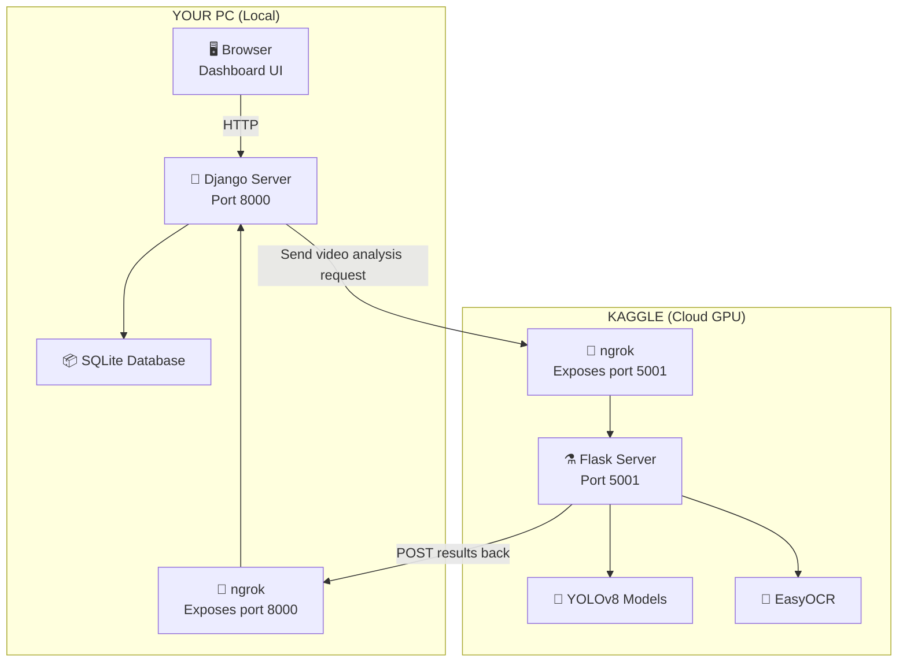
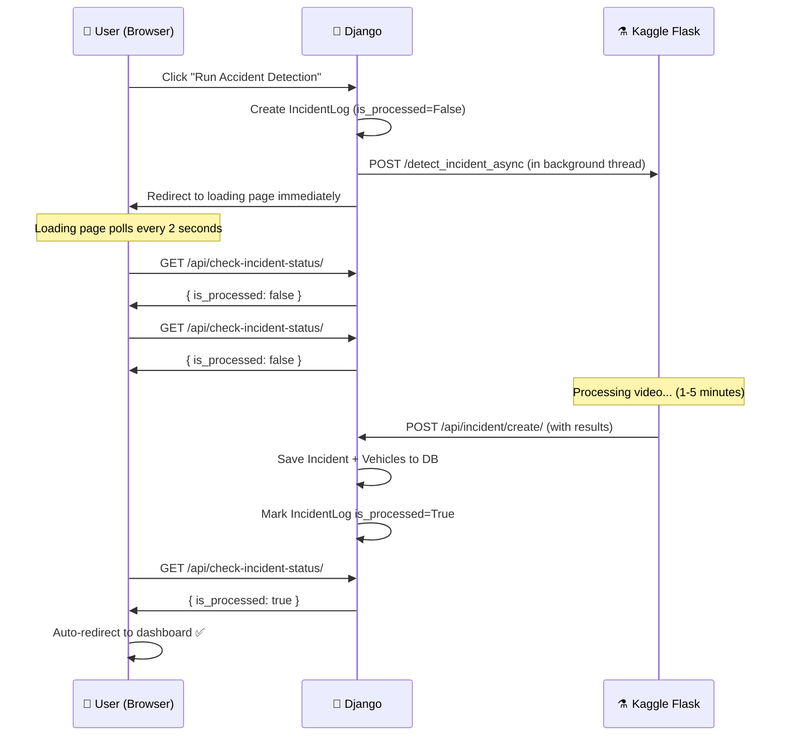
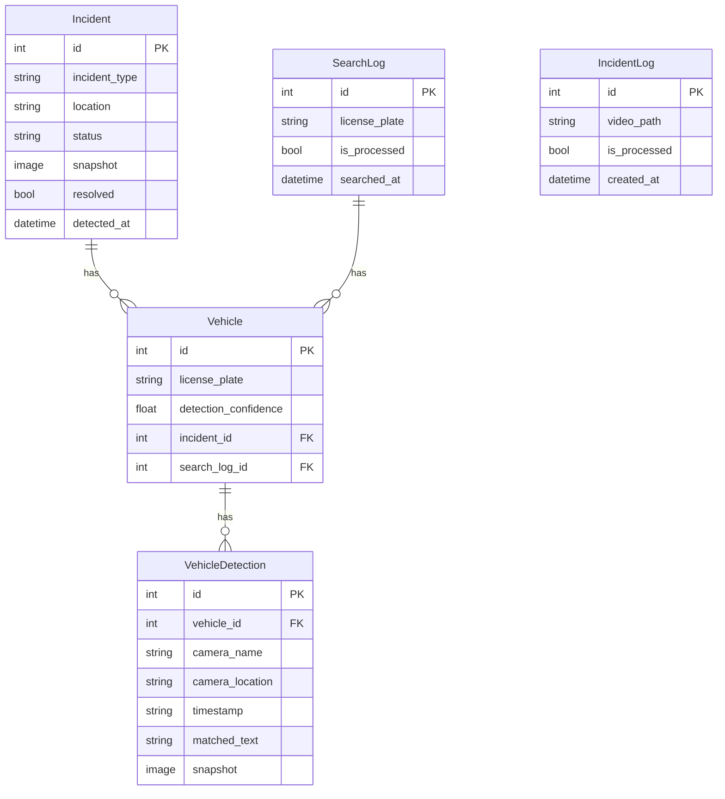

# 🚨 Road Surveillance System — Team Study Guide

> **Purpose**: This document explains the entire Road Surveillance project — how it works, what technologies are used, how the custom AI model was trained, and how all the pieces fit together. Read this before diving into the code.

---

## 1. What Does This System Do?

Our system is an **AI-powered road surveillance platform** that:

1. **Detects anomalies** — Automatically identifies **traffic accidents** and **street fights** from surveillance camera video feeds
2. **Reads license plates** — When an accident is detected, it extracts the license plates of the vehicles involved using OCR
3. **Tracks vehicles** — Searches across multiple camera feeds to find where a specific vehicle has been spotted
4. **Dashboard** — Displays all incidents in a real-time web dashboard with snapshots, timelines, and vehicle routes

---

## 2. Architecture Overview

The system consists of **two servers** running on different machines, connected via **ngrok tunnels**:



| Component | Where it runs | Technology | Purpose |
|-----------|--------------|------------|---------|
| **Django Server** | Your PC | Python Django | Web dashboard, database, user authentication |
| **Flask Server** | Kaggle (GPU) | Python Flask | AI processing — YOLO detection, OCR, tracking |
| **ngrok** (×2) | Both | ngrok tunnels | Makes local servers accessible over the internet |
| **SQLite** | Your PC | SQLite3 | Stores incidents, vehicles, search logs |

### Why Two Servers?

The AI models (YOLOv8) need a **GPU** to run fast. Kaggle provides free GPU access. Django runs locally for the web interface and database. **ngrok** connects the two over the internet.

---

## 3. Technology Stack

### Backend (Django — Local)
| Technology | Version | Purpose |
|-----------|---------|---------|
| **Python** | 3.10+ | Programming language |
| **Django** | 5.2 | Web framework (views, templates, ORM, admin) |
| **Pillow** | Latest | Image handling for saving snapshots |
| **Requests** | Latest | HTTP library for calling the Kaggle API |
| **SQLite** | Built-in | Lightweight database |

### AI Backend (Flask — Kaggle)
| Technology | Version | Purpose |
|-----------|---------|---------|
| **PyTorch** | 2.2.2 | Deep learning framework |
| **Ultralytics YOLOv8** | 8.2.103 | Object detection framework |
| **EasyOCR** | 1.7.1 | Optical Character Recognition for license plates |
| **OpenCV** | 4.10 | Computer vision, image processing |
| **NumPy** | 1.26.4 | Numerical computing |
| **Flask** | 3.0.3 | Lightweight web server for API endpoints |
| **pyngrok** | 7.1.6 | Python wrapper for ngrok tunneling |

### Frontend
| Technology | Purpose |
|-----------|---------|
| **HTML/CSS** | Dashboard UI (no framework, pure HTML) |
| **JavaScript** | AJAX polling for real-time updates |
| **Bootstrap Icons** | Icon library for the UI |

---

## 4. The Custom YOLO Model — How It Was Made

### What is YOLO?

**YOLO** (You Only Look Once) is a real-time object detection algorithm. It looks at an entire image in a single pass and predicts:
- **What** objects are in the image (class: accident, fight, car, etc.)
- **Where** they are (bounding box coordinates)
- **How confident** the model is (0–100%)

### Our Custom Model (`best.pt`)

We **fine-tuned** a pre-trained YOLOv8 model to detect two specific classes:

| Class | Description |
|-------|-------------|
| `accident` | Vehicle collision/crash scenes |
| `fight` | Street fights / physical altercations |

### Training Process

1. **Dataset Collection** — Gathered videos/images of real accidents and fights
2. **Annotation** — Labeled each image with bounding boxes around accident/fight regions (using tools like [Roboflow](https://roboflow.com) or [LabelImg](https://github.com/HumanSignal/labelImg))
3. **Training** — Fine-tuned `yolov8m.pt` (medium model) on the labeled dataset using:
   ```python
   from ultralytics import YOLO
   model = YOLO('yolov8m.pt')  # Start from pre-trained weights
   model.train(data='dataset.yaml', epochs=100, imgsz=640)
   ```
4. **Output** — The training produces `best.pt` — the weights file with the best validation performance

### Two Models Used in the System

| Model File | Type | What It Does |
|-----------|------|-------------|
| `best.pt` | Custom fine-tuned | Detects **accidents** and **fights** |
| `yolov8m.pt` | Pre-trained (auto-downloaded) | Detects **cars** for license plate extraction and tracking |

---

## 5. How Detection Works (The 3-Phase Pipeline)

When you click **"Run Accident Detection"** on the dashboard, here's the complete flow:

### Phase 1: Incident Detection

```
Video (frame by frame) → YOLOv8 custom model → "Is this an accident or fight?"
```

- The model scans each frame and classifies it
- Uses a **sliding window** of 30 frames to avoid false positives
- An incident is confirmed only when **15+ out of 30** consecutive frames are positive
- This prevents a single false detection from triggering an alert

**Key parameters:**
| Parameter | Value | Meaning |
|-----------|-------|---------|
| `CONFIDENCE_THRESHOLD` | 0.60 | Minimum 60% confidence to count a detection |
| `DETECTION_WINDOW_SIZE` | 30 | Rolling window of 30 frames |
| `ACTIVATION_THRESHOLD` | 15 | Need 15 positive frames within the window |

### Phase 2: License Plate Extraction (accidents only)

```
Go back 4 seconds before the crash → Find cars near the impact zone → Crop the bumper area → OCR
```

Steps:
1. Calculate the **impact zone** — centroids of all detected cars at the crash frame
2. Go back `PRE_IMPACT_SECONDS × FPS` frames (4 seconds)
3. For each frame, detect cars using the tracking model
4. Only process cars within `IMPACT_ZONE_RADIUS` (120 pixels) of the impact
5. Crop the bottom 50% of each car (where the plate is)
6. **Forensic upscale** — 3× enlargement + CLAHE contrast enhancement
7. **Blur check** — Skip blurry crops (Laplacian variance < 80)
8. **OCR** — Run EasyOCR restricted to `A-Z, 0-9`
9. **Vote** — Pick the most frequently detected plate text as the consensus

### Phase 3: Cross-Camera Tracking

```
For each detected plate → Search all camera feeds in parallel → Report sightings
```

- Spawns one thread per camera
- Each thread scans its video frame-by-frame
- Uses **fuzzy string matching** (80% similarity threshold) to handle partial OCR reads
- On first match, saves a timestamped snapshot and stops

---

## 6. The Async Callback Pattern

The system uses an **async callback pattern** because AI processing takes minutes, but web requests need to respond in seconds.



**Why this pattern?**
- HTTP requests have timeouts (30 seconds). AI processing takes 1–5 minutes.
- Solution: Django sends the request and immediately shows a loading page.
- The loading page polls the API every 2 seconds to check if processing is done.
- When Kaggle finishes, it POSTs results back to Django (the "callback").

---

## 7. Database Models

The database has **5 tables** defined in [models.py](file:///e:/final%20yr%20project/Road-Surveillance.zip%20final/Road-Surveillance/SurveillanceApp/models.py):



| Model | Purpose | Created When |
|-------|---------|-------------|
| **Incident** | A detected accident or fight | Kaggle sends results back |
| **Vehicle** | A vehicle linked to an incident or search | Plate extraction or manual search |
| **VehicleDetection** | A camera sighting of a vehicle | Camera scan finds a plate match |
| **SearchLog** | Tracks a user's plate search job | User submits a plate search |
| **IncidentLog** | Tracks an anomaly detection job | User clicks "Run Detection" |

---

## 8. Project File Structure — What Each File Does

### Django Project ( [SurveillanceProject/](file:///e:/final%20yr%20project/Road-Surveillance.zip%20final/Road-Surveillance/SurveillanceProject/) )

| File | Purpose |
|------|---------|
| [settings.py](file:///e:/final%20yr%20project/Road-Surveillance.zip%20final/Road-Surveillance/SurveillanceProject/settings.py) | Django config — `KAGGLE_API_URL`, `DJANGO_CALLBACK_URL`, database, installed apps |
| [urls.py](file:///e:/final%20yr%20project/Road-Surveillance.zip%20final/Road-Surveillance/SurveillanceProject/urls.py) | Root URL routing — includes `SurveillanceApp.urls` + admin + logout |

### Django App ( [SurveillanceApp/](file:///e:/final%20yr%20project/Road-Surveillance.zip%20final/Road-Surveillance/SurveillanceApp/) )

| File | Purpose |
|------|---------|
| [models.py](file:///e:/final%20yr%20project/Road-Surveillance.zip%20final/Road-Surveillance/SurveillanceApp/models.py) | Database models (5 tables) |
| [views.py](file:///e:/final%20yr%20project/Road-Surveillance.zip%20final/Road-Surveillance/SurveillanceApp/views.py) | Page views — dashboard, detection triggers, tracking, processing pages |
| [api_views.py](file:///e:/final%20yr%20project/Road-Surveillance.zip%20final/Road-Surveillance/SurveillanceApp/api_views.py) | REST APIs — callbacks from Kaggle, polling endpoints, incident resolution |
| [urls.py](file:///e:/final%20yr%20project/Road-Surveillance.zip%20final/Road-Surveillance/SurveillanceApp/urls.py) | URL routing for all app pages and APIs |
| [admin.py](file:///e:/final%20yr%20project/Road-Surveillance.zip%20final/Road-Surveillance/SurveillanceApp/admin.py) | Django admin panel configuration |

### Templates ( `SurveillanceApp/templates/surveillance/` )

| Template | Page |
|---------|------|
| `login.html` | Login page |
| `dashboard.html` | Main dashboard with stats + incident list + detection buttons |
| `details.html` | Incident detail page (snapshot + vehicle route timeline) |
| `vehicle-tracking.html` | License plate search form |
| `processing.html` | Loading page while tracking a vehicle |
| `processing_incident.html` | Loading page while detecting incidents |
| `tracking-result.html` | Vehicle tracking results with camera sighting timeline |

### Kaggle Notebook

| File | Purpose |
|------|---------|
| [new-api.ipynb](file:///e:/final%20yr%20project/Road-Surveillance.zip%20final/Road-Surveillance/new-api.ipynb) | The complete Kaggle server — Flask API + YOLO detection + OCR + tracking |

---

## 9. URL Routing — All Endpoints

### Pages (require login)

| URL | View | What it shows |
|-----|------|-------------|
| `/` | `dashboard` | Main dashboard |
| `/login/` | `login_view` | Login form |
| `/logout/` | Django built-in | Logs out and redirects |
| `/anomaly-detection/` | `anomaly_detection` | Triggers accident detection |
| `/fight-anomaly-detection/` | `fight_anomaly_detection` | Triggers fight detection |
| `/anomaly-detection/processing/<id>/` | `incident_processing` | Loading page during detection |
| `/incident/<id>/` | `incident_detail` | Single incident details |
| `/tracking/` | `tracking` | Vehicle search form |
| `/tracking/processing/<id>/` | `processing` | Loading page during tracking |
| `/tracking/<id>/` | `tracking_results` | Tracking results |

### APIs

| URL | Method | Purpose |
|-----|--------|---------|
| `/api/incidents/` | GET | Get recent incidents list (for dashboard refresh) |
| `/api/incident/create/` | POST | **Callback** — Kaggle posts incident results here |
| `/api/incident/<id>/resolve/` | POST | Mark incident as resolved |
| `/api/search/result/` | POST | **Callback** — Kaggle posts search results here |
| `/api/check-status/<id>/` | GET | **Polling** — Is vehicle search done? |
| `/api/check-incident-status/<id>/` | GET | **Polling** — Is incident detection done? |

---

## 10. Key Concepts to Understand

### ngrok — Making local servers accessible
ngrok creates a secure tunnel from the internet to your local machine. When you run `ngrok http 8000`, it gives you a public URL like `https://xxx.ngrok-free.dev` that forwards traffic to your `localhost:8000`.

### CSRF Exemption
The callback APIs (`create_incident_api`, `search_result_api`) use `@csrf_exempt` because they receive POST requests from Kaggle (external server), not from a browser with CSRF tokens.

### Threading
Django uses **background threads** (`threading.Thread`) to send requests to Kaggle without blocking the HTTP response. The thread is marked as `daemon=True` so it dies automatically if Django shuts down.

### Forensic Upscaling
License plates in surveillance footage are tiny. The system:
1. Crops the bumper area (bottom 50% of car bounding box)
2. **Upscales 3×** using Lanczos interpolation (high-quality resize)
3. Converts to grayscale
4. Applies **CLAHE** (Contrast Limited Adaptive Histogram Equalization) to enhance contrast

### Fuzzy String Matching
OCR is imperfect — a plate reading might be `845ZD5` instead of `845ZDS`. The system uses `SequenceMatcher` to compare strings:
```python
similar("845ZD5", "845ZDS")  # Returns 0.83 — above 0.80 threshold → MATCH
```

---

## 11. Quick Setup Cheat Sheet

```
1. cd Road-Surveillance
2. python -m venv SurveillanceEnv
3. SurveillanceEnv\Scripts\activate
4. pip install django pillow requests
5. python manage.py migrate
6. python manage.py createsuperuser
7. python manage.py runserver          ← Terminal 1
8. ngrok http 8000                     ← Terminal 2
9. Update DJANGO_CALLBACK_URL in settings.py with ngrok URL
10. Set up Kaggle notebook (5 cells) → get Kaggle ngrok URL
11. Update KAGGLE_API_URL in settings.py
12. Restart Django → Test at http://127.0.0.1:8000
```

---

## 12. Common Questions

**Q: Why not run everything on one server?**
A: The YOLO model needs a GPU. Kaggle provides free GPUs. Your PC likely doesn't have one powerful enough.

**Q: Why does the ngrok URL change?**
A: Free ngrok accounts get a random URL each time. Paid accounts can get a fixed domain.

**Q: What happens if Kaggle times out?**
A: Kaggle notebooks auto-stop after ~12 hours. You need to re-run the cells. The Django side handles timeouts gracefully — if Kaggle doesn't respond, it marks logs as processed so the UI doesn't hang.

**Q: Can we add more cameras?**
A: Yes! Update the `CAMERA_FEEDS` dictionary in the Kaggle notebook with more video paths. The tracking system automatically spawns one thread per camera.

**Q: How accurate is the model?**
A: It depends on the training data. The sliding window (15/30 threshold) reduces false positives. You can fine-tune `CONFIDENCE_THRESHOLD`, `DETECTION_WINDOW_SIZE`, and `ACTIVATION_THRESHOLD` in the Kaggle notebook.
